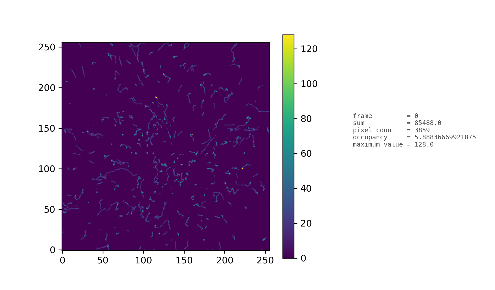
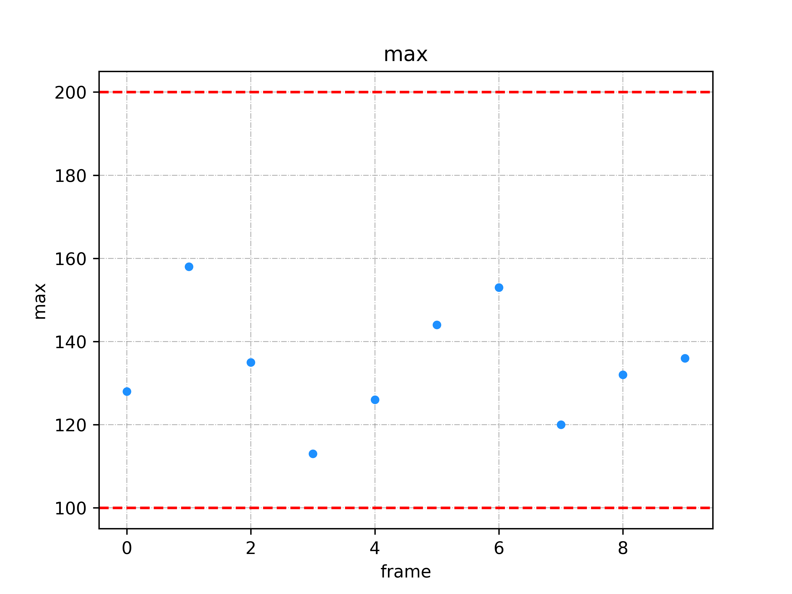

## Introduction

This example is based on `linux` MUI example. It can be beneficial for testing detector fuctionality. All mentioned numbers and estaimation are done with defualt settings of scripts and with Stroncium 90 radiation source places on tip of the detector alumium cover (detector cover as it is in the case of Minipix Space).

## Quick start

To run the test, follow these steps:

1. Get the current version of of software `minipix_usart_interface`
2. Install the device and do needed adjustmensts based on this intenal wiki web page http://odin/wiki/index.php/Minipix_uart_interface_setup#Compilation_of_the_Gatherer_and_Run_the_Test
3. Check the pregenerated results in the `example_interface/linux_test/out/test/` to know what to expect if stroncium 90 is placed on top of the aluminum protection of the sensor. 
4. Go to `minipix_uart_interface/software/` and if directory `build` is present then remove it with `rm -r build`
5. Run the test script `./test.sh`  (for example with some source of radiation on top of the aluminium protection) . It might be needed to give it a rules to be an executable with `chmod +x test.sh` and then run it. It should do the compilation, start simple acquisition of 10 frames with 0.25 s acq time and saves data into `example_interface/linux_test/out/test/data.txt` . 
6. It also automatically analyses and creates simple plots of frames into the same path.

## Measurement 

It might happen that after running `./test.sh` some errors might occur most likely in the part of the minipix measurement. The probability that such a thing might happen is almost 50%. These are features of the software and the device has to be restarted:
1. Unplug the device connection, for example the usb if it is used
2. Plug it back
3. Wait some 10s 
4. Start the script `./test.sh`
If the error still remains after several tries, please, contact technical support :).

## Test of functionality

After running the test as it is described in the section `qucik start`, the first lead whether detector is still functional can be found in the produced plots. In the case of usage of stroncium 90, curly tracks should be seen in the detector and if default settings was used (250 ms of act time) then the features should as it is in the figure above (in the section `quick start`). The sum should be approximately 9e4 and maximum not higher than 300. This behaviour can be checked in the produced graphs:

where red lines limit the range of normal detector response.